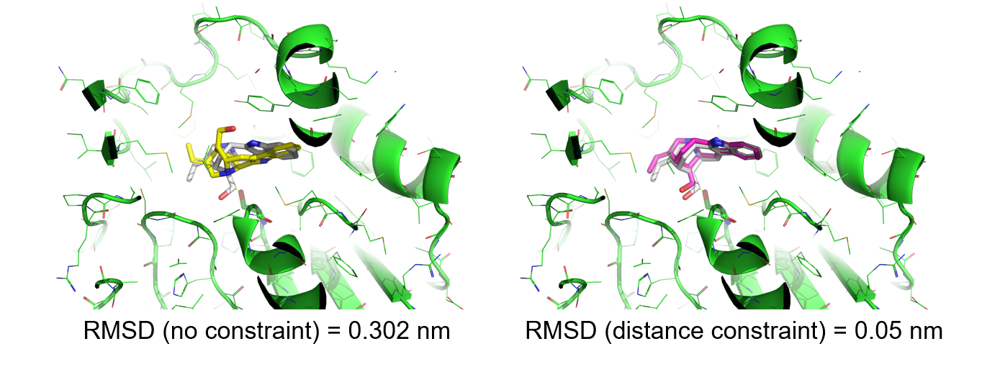
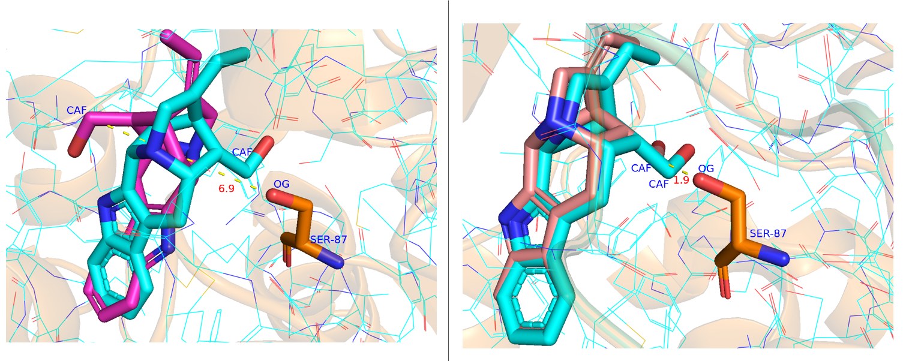

.. _constrained_docking:

Custom constraint docking
=========================

The purpose of setting intermolecular constraints in molecular docking is to restrict the relative position and orientation between a small molecule and a protein, guiding and optimizing the search for binding modes.
In OpenDock, inter-molecular constraints can be implemented using the Constraint class.
This Constraint can be considered an extension of a force field function, allowing for the control of molecular motion through the adjustment of constraint positions and strengths using harmonic functions and corresponding force constants.

1. Atom selection for distance constraint 
-------------------------------------------
Before we really start to define a distance constraint, the key atoms for restriction should be selected.
By using ``AtomSelection``, the atoms from the protein and the ligand could be selected. 
In some cases, multiple atoms could be defined. The following code block provides some examples.

.. note::
    The source code of this atom selection language module is stored in ``opendock/core/asl.py``. Atom selection is way of obtaining the atom indices in a ``receptor`` object or a ``ligand`` object. Before you define these atom selections, please make sure the atom name, residue indices (residue sequence number in the PDB file) as well as the chain identifier are correct. 

.. code-block:: bash

    from opendock.core.asl import AtomSelection 

    # select the sidechain oxygen atoms in residue Glu5 of a protein in chain A
    asl = AtomSelection(molecule=receptor)
    indices = asl.select_atom(atomnames=['OE1,OE2',], chains=['A'], residx=['5'], resnames=['GLU'])
    print(indices)

    # select all the backbone atoms in residues 120 to 122 in protein chain A
    asl = AtomSelection(molecule=receptor)
    indices_r = asl.select_atom(atomnames=['C,O,N,CA',], chains=['A'], residx=['120-122'])
    print(indices_r, receptor.dataframe_ha_.head())

    # select two atoms, with atom name as N2 or C13 in a ligand
    asl = AtomSelection(molecule=ligand)
    indices_l = asl.select_atom(atomnames=['N2,C13',])
    print(indices_l, ligand.dataframe_ha_.head())
    
    # constraints defined by a distance constrain object
    cnstr = DistanceConstraintSF(receptor, ligand, 
                                 grpA_ha_indices=indices_r, 
                                 grpB_ha_indices=indices_l, 
                                 )
    print(cnstr.scoring())

2. Distance constraint between atomic pairs
-------------------------------------------

Atom selection example. In the following example (pdb: 3gzj), the OG
atom of the SER-87 side chain of the protein and the CAF atom of the
ligand are chosen as the constraint targets, with a constraint distance of 1.5. 
The modeling code is as follows:

.. note:: 
    Please note that the residue index (``residx``) is generally 1-based as indicated in the PDB file.
       The above atomic names have some differences between protein PDB files and PDBQT files, but the atoms are the same.
.. code-block:: bash

    from opendock.scorer.constraints import DistanceConstraintSF
    from opendock.scorer.hybrid import HybridSF
    from opendock.core.asl import AtomSelection 

     #set constrain
    asl = AtomSelection(molecule=receptor)
    indices_r = asl.select_atom(atomnames=['OG', ], chains=['A'], residx=['78'],resnames=['SER'] )
    
    asl = AtomSelection(molecule=ligand)
    indices_l = asl.select_atom(atomnames=['CAF', ])

    # constraints
    costr = DistanceConstraintSF(receptor, ligand,
                                 grpA_ha_indices=indices_r,
                                 grpB_ha_indices=indices_l,
                                 constraint='wall',
                                 bounds=[1.5, 1.5]
                                 )
    # vina scoring function
    vina_sf = VinaSF(receptor, ligand)

    # combined scoring function
    sf = HybridSF(receptor, ligand, scorers=[vina_sf, costr], weights=[0.5, 0.5])
    
    #set sampling strategy
    sampler = samplers[args.sampler][0](ligand, receptor, sf,
                                            box_center=xyz_center,
                                            box_size=box_sizes,
                                            minimizer=minimizers[args.minimizer],
                                            )
    #sampling
    ……
The modeling results with and without constraints are as follows,where gray represents the native conformation, and yellow and pink represent the
conformations after docking with OpenDock.:

For more details, when docking is performed without constraints, the atom pairs selected in the resulting structure often have greater distances.
In the figure, the unconstrained atomic distance is 6.9, and the docking conformation also differs significantly from the natural conformation (blue).
When constraints are used, the atomic distance is 1.9, and the docking conformation is very close to the natural conformation.

3. Distance matrix constraint
------------------------------

When you have predicted the positions of all ligand atoms and expect to dock in the direction you desire,
you can generate a distance matrix (between the alpha carbon of the residues in the receptor and the heay atoms in the ligand) and use it as a constraint to guide docking in the desired direction.

In the following example,you can import a distance matrix from outside as a constraint.

.. code-block:: bash

    #waiting for updates
    from opendock.scorer.constraints import DistanceConstraintSF,DistanceMatrixConstraintSF
    from opendock.scorer.hybrid import HybridSF
    from opendock.core.asl import AtomSelection

    
    # constraints
    cnstr = DistanceMatrixConstraintSF(receptor, ligand,
                                       constraint='wall',
                                       bounds=[0.0, 0.0]
                                       )
    distances_mean, distances_matrix = cnstr.get_distance_matrix()
    # Define external distance matrix,default to txt file

    external_distances_matrix_file_path = os.path.join('./', 'external_distances_matrix.txt')
    distances_matrix_from_file = np.loadtxt(external_distances_matrix_file_path)

    #Set the distance matrix for constraints
    cnstr.distances_matrix = torch.tensor(distances_matrix_from_file)

    print(cnstr.scoring())
    #Set Vinascore to avoid atomic conflicts
    vina_sf = VinaSF(receptor, ligand)
    print("Vina Score ", vina_sf.scoring())

    # combined scoring function
    sf = HybridSF(receptor, ligand, scorers=[vina_sf, cnstr], weights=[0.5, 0.5])
    vs = sf.scoring()
    print("HybridSF Score ", vs)

For this tutorial, all the basic material are provided and can be found 
in the ``opendock/opendock/protocol`` directory

You can find this script in the ``example`` folder of OpenDock available on Github. To execute it from a command line,
go to your terminal/console/command prompt window. Navigate to the ``examples`` folder by typing

.. code-block:: console

    $ cd opendock/example/3gzj
    $ python atom_pair_distance_constraint_example.py -c vina.config # Distance constraint between atomic pairs
    $ cd opendock/example/1gpn
    $ python distance_matrix_constraint_example.py -c vina.config # Distance matrix constraint

