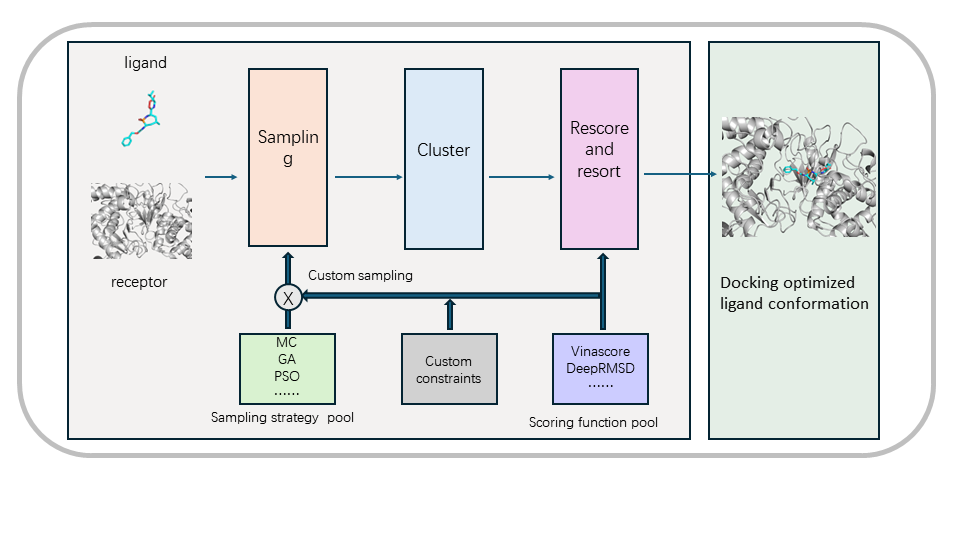
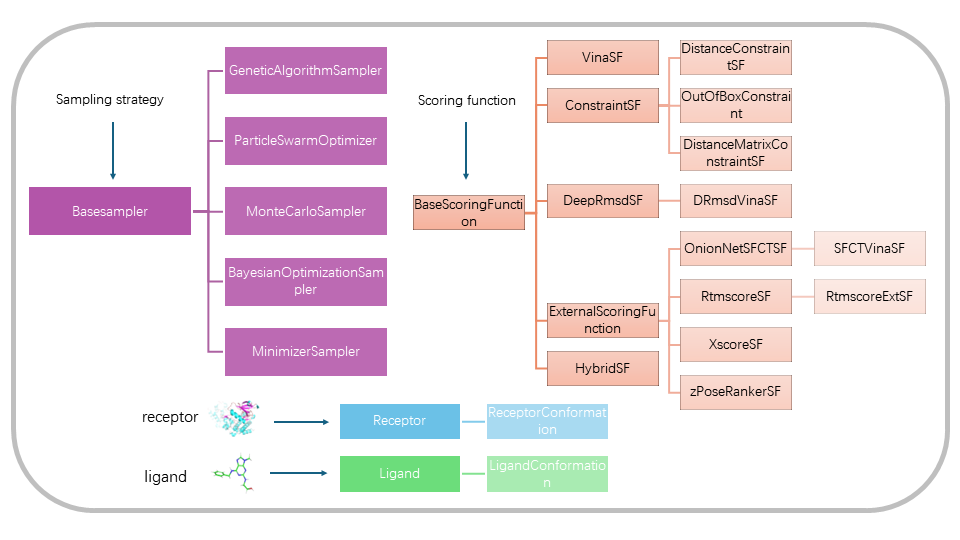

.. _framework:

Framework architecture of OpenDock
=============
Before starting molecular docking, we need to have a basic understanding of the overall framework architecture. 
Opendock can support various sampling strategies and scoring functions (with user-defined constraints as defined in ```Constraint``` class).
The following is the overall framework diagram of OpenDock.



Opendock employs numerous classes. The diagram below reveals the inheritance relationships 
among classes related to sampling strategies and scoring functions. 
Understanding these aspects can facilitate more customized usage of Opendock.



